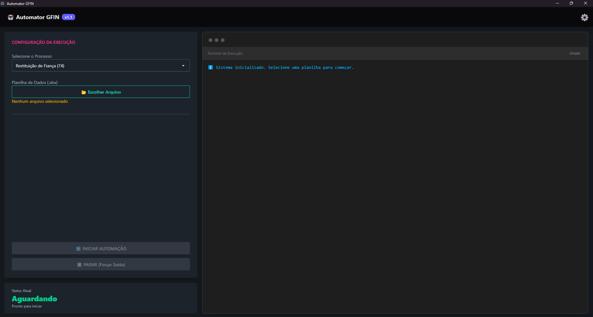

# 🤖 Automator GFIN - Robô de Finanças

Ferramenta de automação desktop para processamento de **Restituições** e outros processos financeiros no portal SIOFI, SARE e ARR. Desenvolvido com Electron, Node.js e Puppeteer.

## ✨ Funcionalidades

* **Processamento em Lote:** Lê planilhas Excel e preenche formulários web automaticamente.
* **Inteligência de Navegação:** Lida com logins, popups e múltiplas abas.
* **Relatórios Automáticos:** Gera planilhas de "Sucesso" e "Erro" ao final.
* **Evidências:** Tira prints automáticos de cada operação.
* **Logs Detalhados:** Histórico completo de execução salvo em texto.

## 🚀 Como Iniciar (Sem Instalação)

Esta versão é **Portátil**. Não requer direitos de administrador.

1.  Baixe a pasta do projeto.
2.  Certifique-se de estar conectado à internet e ter o NodeJS (v18.0 ou superior) instalado.
3.  Clique duas vezes no arquivo **`iniciar.bat`**.
4.  O sistema irá configurar tudo sozinho e abrir a janela do robô.

## 🛠️ Configuração

As configurações de URLs e Mapeamento de Colunas ficam no arquivo:
`config/profiles.json`
Você pode editar este arquivo diretamente ou usar a aba de configurações dentro do aplicativo.

## 📋 Como Usar

1.  Abra o aplicativo.
2.  Selecione o **Tipo de Processo** (Ex: Restituição de Fiança).
3.  Carregue a **Planilha de Dados** (.xlsx).
4.  Clique em **INICIAR AUTOMAÇÃO**.
5.  O navegador abrirá. **Faça o Login manualmente** e clique em "Iniciar Processamento" na janela de aviso.
6.  Aguarde o fim da execução.

## 📁 Onde ficam os arquivos?

Por padrão, os relatórios e prints são salvos em:
`C:/AutomacaoFinanceira`

## Diretório da Aplicação
A estrutura do projeto é organizada da seguinte forma:
```
automacao_gefin_app/
├── config/                 # Arquivos JSON de configuração
│   └── profiles.json       # Define URLs e regras de cada tipo de formulário
├── docs/                   # Documentação técnica e especificações
│   ├── debug/                # Documentos relacionados a testes e depuração
│   ├── 'Especificação Técnica de Fluxo_ Robô de Cadastro de Beneficiário.md'
│   ├── 'Especificação Técnica de Fluxo_ Robô de Consulta de OPE Quitada.md'
│   ├── 'Especificação Técnica de Fluxo_ Robô de Restituição.md'
│   ├── 'Especificação Técnica de Fluxo_ Robô de Marcação ARR.md'
│   ├── 'Especificação Técnica de Fluxo_ Robô de Marcação Terminal.md'
│   ├── 'Esqueleto Padrão para Desenvolvimento de Bots (Blueprint).md'
│   ├── 'prompt_Create_Automated_Tests_with_Jest.md'
│   ├── 'prompt_Create_Utility_Functions.md'
│   └── prompts_ia.md
├── img/                    # Imagens e assets visuais
│   └── 'Tela do Terminal inicial.png'
├── logs/                   # Pasta para salvar logs de execução
│   └── sistema-YYYY-MM-DD.log
├── src/
│   ├── main/               # Processo Principal (Backend do Electron)
│   │   ├── main.js         # Ponto de entrada (cria a janela principal)
│   │   └── preload.js      # Ponte segura entre Frontend e Backend
│   ├── backend/            # Lógica do Robô (Node.js + Puppeteer)
│   │   ├── manager.js      # Gerencia a fila de automações e o navegador
│   │   ├── bots/           # Scripts específicos para cada tipo de automação
│   │   │   ├── cadastro-beneficiario.js 
│   │   │   ├── consultar-ope-quitada.js
│   │   │   ├── marcacao-arr.js
│   │   │   ├── marcacao-terminal.js
│   │   │   ├── restituicao-fianca_icms_itcd.js
│   │   │   ├── restituicao-ipva.js
│   │   │   ├── marcacao-terminal.test.js
│   │   │   └── consultar-ope-quitada.test.js
│   │   └── utils/          # Funções utilitárias reutilizáveis
│   │       ├── arr-utils.js
│   │       ├── file-utils.js
│   │       ├── logger.js
│   │       ├── navigation-utils.js
│   │       ├── puppeteer-utils.js
│   │       └── terminal-utils.js
│   └── frontend/           # Processo de Renderização (Interface do Usuário)
│       ├── index.html      # Estrutura HTML da interface
│       ├── logger.js       # Lógica de logging para o frontend
│       ├── renderer.js     # Lógica de interação da interface (botões, atualização de logs)
│       └── styles/         # Estilos CSS da aplicação
│           ├── input.css
│           └── output.css  # Gerado pelo TailwindCSS
├── tests/                  # Arquivos de teste
│   └── frame-test-restituicao.html
├── uploads/                # Modelos de arquivos para upload
│   └── modelo-teste_fianca.xlsx
├── .gitignore              # Arquivo de ignorados do Git
├── iniciar.bat             # Script para iniciar a aplicação (versão portátil)
├── LICENSE.md              # Informações de licença
├── package-lock.json       # Bloqueio de dependências do npm
├── package.json            # Metadados do projeto e dependências
├── README.md               # Documentação principal do projeto
└── 'modelo-GFIN AUTOMATOR-v.1.1.xlsm' # Modelo de planilha
```

## Tela Inicial


## Links de Acesso
[Drive](https://drive.google.com/drive/folders/1-lZU1EYFpA2yV12Lkg4z1i1oERVA2F2A?usp=sharing)

## 📝 Licença
© 2026 Todos os direitos Reservados. **Desenvolvido para uso interno GFIN(Gerência de Administração Financeira da Subsecretaria do Tesouro Estadual de Goiás).**
