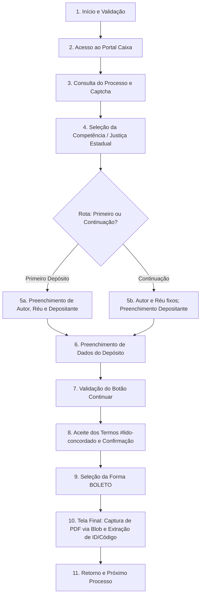

# Especificação Técnica de Fluxo: Robô de Emissão de Guia de Depósito Judicial

| Atributo | Detalhe |
| :--- | :--- |
| **Autor** | Manus AI |
| **Data** | 08/05/2026 (Atualizado: 03/09/2026) |
| **Versão** | 1.2 |
| **Arquivo Base** | `src/backend/bots/emissao-guia-deposito.js` |
| **Perfil ID** | `emissao-guia-deposito` |

## 1. Visão Geral

O robô **Emissão de Guia de Depósito Judicial** automatiza o processo de geração de guias de depósito no portal da Caixa Econômica Federal. Ele suporta tanto **Primeiro Depósito** (`/estadual/primeiro`) quanto **Depósito em Continuação** (`/estadual/continuacao`), preenche os dados das partes e valores, realiza o aceite de confirmação, avança pela seleção de boleto e captura o PDF e os metadados gerados (ID do Depósito e Código de Barras).

## 2. Componentes do Sistema

### 2.1. Entradas (Planilha Excel)
O robô espera uma planilha com as seguintes colunas (conforme mapeamento no `profiles.json`):

| Coluna Interna | Nome na Planilha (Padrão) | Descrição |
| :--- | :--- | :--- |
| `PROCESSO` | `Proc. Judicial` | Número do processo judicial (formato CNJ). |
| `CPF_CNPJ_AUTOR` | `CPF/CNPJ Autor` | Documento de identificação do Autor. |
| `CPF_CNPJ_REU` | `CPF/CNPJ Réu` | Documento de identificação do Réu. |
| `MUNICIPIO` | `Município` | Nome do município para a guia (ex: GOIANIA). |
| `VALOR` | `Valor` | Valor do depósito (numérico ou formatado). |
| `DATA_VENCIMENTO`| `Data de Vencimento` | Data limite para pagamento da guia. |
| `OBSERVACAO` | `Observação` | Texto livre que será usado no nome do arquivo PDF. |

### 2.2. Configurações Fixas
Parâmetros definidos no `profiles.json` que não variam por linha:

*   **TELEFONE:** Telefone de contato enviado no formulário.
*   **CPF_CNPJ_DEPOSITANTE:** Documento do órgão depositante (GFIN).
*   **texto_cartao_justica:** Título do cartão de seleção (Padrão: "Justiça Estadual").
*   **estado_value:** Valor interno para seleção do estado (Padrão: "1: Object" para Goiás).

## 3. Fluxo Operacional

1.  **Inicialização:**
    *   Leitura da planilha e validação de campos obrigatórios.
    *   Criação da estrutura de pastas para logs e evidências.
2.  **Acesso ao Portal:**
    *   Navegação para `https://novodepositojudicial.caixa.gov.br/judicial`.
3.  **Consulta de Processo:**
    *   Inserção do número do processo no campo `#in-processo`.
    *   **Detecção de Captcha:** O robô detecta a presença de desafio de Captcha. Caso não haja, efetua a consulta automática; caso haja, aguarda a resolução do operador.
4.  **Seleção de Justiça:**
    *   Identifica e clica no cartão com título `"Justiça Estadual"` usando evento de hardware para transição de rota SPA.
5.  **Diferenciação de Rota (Primeiro vs Continuação):**
    *   **Primeiro Depósito (`/estadual/primeiro`):** Preenchimento de Autor e Réu nos componentes `app-validar-documento` e seleção de depositante "Outros" com CPF/CNPJ do órgão.
    *   **Depósito em Continuação (`/estadual/continuacao`):** Autor, Réu, Estado e Município vêm pré-preenchidos como texto estático pela Caixa. O robô detecta a ausência de inputs editáveis e prossegue de forma resiliente preenchendo apenas os campos necessários (Depositante "Outros").
6.  **Dados do Depósito:**
    *   Preenchimento do telefone e seleção de Estado/Município (quando editáveis).
    *   **Tratamento de Máscara Monetária (`currencymask`):** Limpeza e emissão de eventos nativos de teclado (`keydown`, `keypress`, `keyup`) para cada dígito numérico, ativando corretamente o `FormControl` reativo do Angular.
    *   Preenchimento da data de vencimento e campo de observação.
7.  **Etapa de Confirmação e Aceite de Termos:**
    *   Inspeção defensiva do botão `Continuar`.
    *   Marcação do checkbox `#lido-concordado` com disparo de `input` e `change`.
    *   Espera ativa até que o botão `Confirmar` esteja habilitado (`disabled === false`) antes de clicar.
8.  **Seleção da Forma de Pagamento:**
    *   Seleção da opção `BOLETO` (`input[formcontrolname="formaPagamento"][value="BOLETO"]`) e clique em `Continuar`.
9.  **Captura de PDF e Extração de Metadados (`/judicial/boleto`):**
    *   Extração direta do DOM da página do **ID do Depósito** e do **Código de Barras**.
    *   Interceptação de `URL.createObjectURL` e clique no botão `"Ver boleto bancário"`.
    *   Extração do binário do PDF via `fetch` do `Blob` gerado, validação de integridade (`%PDF-`) e salvamento em arquivo no disco.
    *   Clique em `"Novo Depósito"` para resetar o fluxo para o próximo registro da planilha.

## 4. Tratamento de Erros e Exceções

*   **Campos Pré-preenchidos:** Não geram erro; o robô identifica controles somente leitura e aproveita os dados preenchidos pela Caixa.
*   **Campos Ausentes / Inválidos:** Se algum campo obrigatório não for aceito e o botão `Continuar` permanecer desabilitado, o robô diagnostica quais controles estão com `.ng-invalid` e registra no log.
*   **Captura de PDF Indireta:** A nova rotina de captura intercepta o `Blob` criado pelo botão de visualização, dispensando a dependência do log de console.
*   **Interrupção:** O robô respeita o comando de cancelamento da interface gráfica a qualquer momento do ciclo.

## 5. Requisitos Técnicos

*   **Puppeteer Stealth:** Utilizado para evitar bloqueios de bot no portal da Caixa.
*   **AngularHelper / Angular-Utils:** Gerencia eventos reativos do framework (`input`, `change`, `blur`), diretivas de máscara monetária, captura de Blobs de PDF e seletores flexíveis.
*   **Navigation Utils:** Gerencia formatação de datas e moedas no padrão pt-BR.
